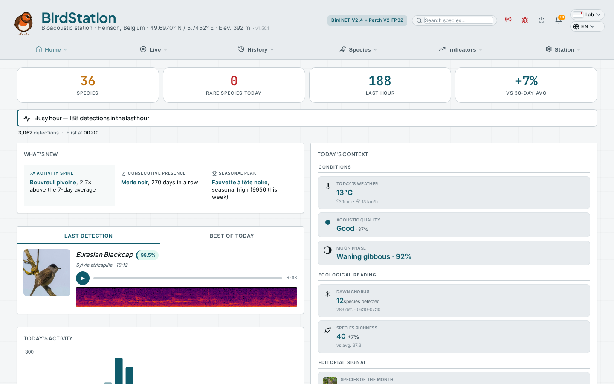
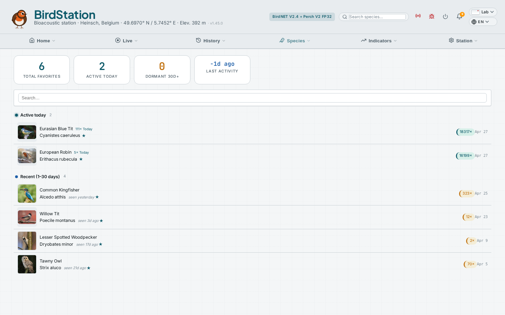
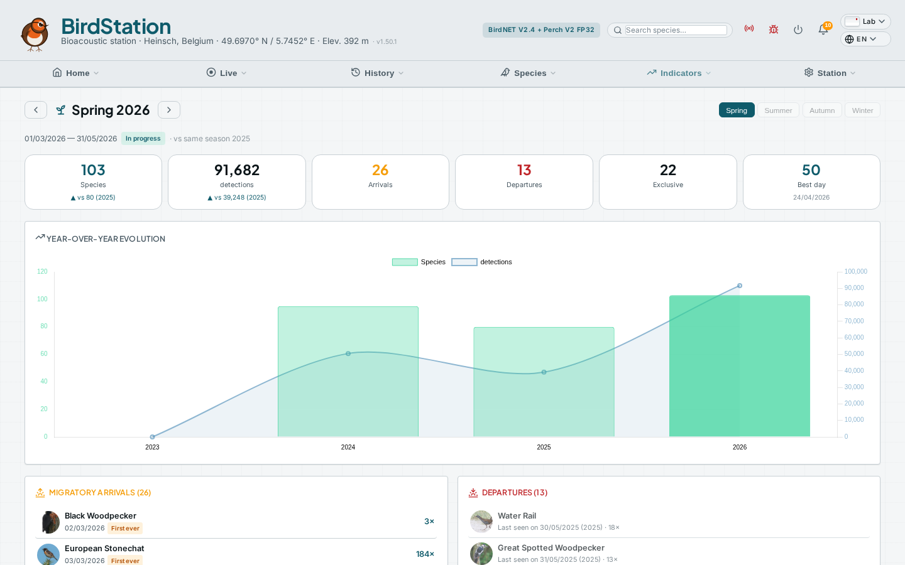
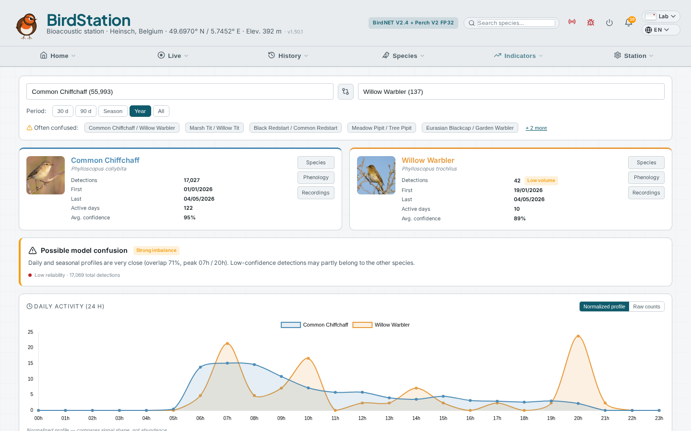

# 🐦 BirdStation

[](LICENSE)
[](https://nodejs.org)
[](https://vuejs.org)
[](CONTRIBUTING.md)

Modernes Vogelerkennungs-Dashboard und Engine für Raspberry Pi 5. Eigenständige Dual-Modell-Architektur mit BirdNET V2.4 + Perch V2. Community-Netzwerk mit Live-Stationskarte. Anpassbarer Stationsname und Branding.

> [English](README.md) | [Français](README.fr.md) | [Nederlands](README.nl.md) | [Contributing](CONTRIBUTING.md)

## Screenshots

**Highlights** — horizontal scrollen für einen Überblick der Hauptseiten. Vollständige Galerien pro Sektion sind unten ausklappbar.

<table>
  <tr>
    <td align="center"></td>
    <td align="center"></td>
    <td align="center"></td>
    <td align="center"></td>
    <td align="center"></td>
    <td align="center"></td>
    <td align="center"></td>
  </tr>
  <tr>
    <td align="center"><sub><b>Übersicht</b><br>KPIs &amp; Vogel des Tages</sub></td>
    <td align="center"><sub><b>Heute</b><br>Live-Erkennungen + Filter</sub></td>
    <td align="center"><sub><b>Spektrogramm</b><br>Vollbild + Wetter-Chip</sub></td>
    <td align="center"><sub><b>Wetter</b><br>Leaderboards · Heatmap · Suche</sub></td>
    <td align="center"><sub><b>Arten</b><br>Verlauf + Wetterprofil</sub></td>
    <td align="center"><sub><b>Aufnahmen</b><br>Bibliothek + Beste je Art</sub></td>
    <td align="center"><sub><b>Prüfung</b><br>Auto-Flag + Massenaktionen</sub></td>
  </tr>
</table>

<details>
<summary><b>Live</b> — Dashboard · Heute · Spektrogramm</summary>

<p align="center">
  
  
  
</p>
</details>

<details>
<summary><b>Verlauf</b> — Kalender · Timeline · Erkennungen · Prüfung</summary>

<p align="center">
  
  
  
  
</p>
</details>

<details>
<summary><b>Arten</b> — Art · Aufnahmen · Galerie · Seltenheiten · Favoriten</summary>

<p align="center">
  
  
  
  
</p>
</details>

<details>
<summary><b>Auswertungen</b> — Wetter · Statistiken · Modelle · Analysen · Biodiversität · Phänologie · Jahreszeiten · Vergleich</summary>

<p align="center">
  
  
  
  
  
  
  
  
</p>
</details>

<details>
<summary><b>Station</b> — Systemzustand, Einstellungen &amp; Terminal</summary>

<p align="center">
  
  
  
  
</p>
<p align="center">
  
  
  
  
</p>
<p align="center">
  
  
  
  
</p>
</details>

## Architektur

> **[Vollständige Architekturdokumentation →](ARCHITECTURE.de.md)** — technische Referenz: Audio-Pipeline, Datenbankschema, Performance und mehr.

```
Raspberry Pi 5 + SSD
├── USB Audio-Interface
│     ↓
├── BirdEngine (Python)
│   ├── Aufnahme (arecord → WAV 45s)
│   ├── Audio-Pipeline: Adaptive Verstärkung → Hochpass → Tiefpass
│   │   → Geräuschprofil-Subtraktion → RMS-Normalisierung
│   ├── BirdNET V2.4    (~1.5s/Datei, primär)
│   ├── Perch V2         (~0.7s/Datei auf Pi 5, sekundär)
│   ├── MP3-Extraktion + Spektrogramme
│   └── BirdWeather-Upload
│
├── Birdash (Node.js)
│   ├── Dashboard-API (Port 7474)
│   ├── Live-Spektrogramm (PCM + MP3-Stream)
│   ├── Push-Benachrichtigungen via Apprise (100+ Dienste)
│   ├── Erkennungsprüfung + Auto-Flagging
│   ├── Telemetrie (Opt-in Supabase)
│   └── In-App-Bug-Reporting (GitHub Issues)
│
├── Caddy (Reverse Proxy :80)
├── ttyd (Web-Terminal)
└── SQLite (1M+ Erkennungen)
```

## Funktionen

### Detektions-Engine (BirdEngine)
-  **Dual-Modell-Inferenz** — BirdNET V2.4 (~1.5s/Datei) + Perch V2 (~0.7s/Datei auf Pi 5) parallel. Modellvariante automatisch je Pi gewählt: FP32 auf Pi 5, FP16 auf Pi 4, INT8 auf Pi 3
-  **Dual-Modell-Kreuzbestätigung** — Perch-Erkennungen unter einem Standalone-Schwellwert (Standard 0.85) müssen von BirdNET (Roh-Score ≥ 0.15) auf einem überlappenden Chunk bestätigt werden. Eliminiert die meisten Perch-Falschmeldungen bei niederfrequentem Lärm (Wind, Fahrzeuge → Gänse/Reiher/Raben), ohne Perchs Vorteile bei seltenen Arten zu verlieren. Alle drei Schwellen einstellbar in Einstellungen → Erkennung mit (i)-Tooltips
-  **Artspezifische Drosselung** — Opt-in, Cooldown pro Art (Standard 120 s), verhindert dass dominante Arten (Spatzen, Amseln…) die DB fluten, während hochkonfidente Erkennungen (≥ Bypass-Schwelle, Standard 0.95) immer durchgelassen werden. Zustand im Speicher der Engine, Hot-Reload aus `birdnet.conf`. Skript `scripts/cleanup_throttle.py` für rückwirkende Bereinigung des Verlaufs mit `--dry-run` / `--apply`, DB-Backup und Audio-Quarantäne — typisch 60-70 % Bereinigung auf geräuschintensiven Stationen
-  **Lokale Aufnahme** — beliebige USB-Audio-Schnittstelle via ALSA mit konfigurierbarer Verstärkung
-  **Adaptive Geräusch-Normalisierung** — automatische Software-Verstärkung basierend auf Umgebungsgeräusch, mit Clip-Schutz, Aktivitätshaltung und Beobachtermodus
-  **Audiofilter** — konfigurierbarer Hochpass + Tiefpass (Bandpass), spektrale Geräuschunterdrückung (stationäres Gating), RMS-Normalisierung
-  **BirdWeather** — automatischer Upload von Soundscapes + Erkennungen
-  **Smarte Push-Benachrichtigungen** — via Apprise (ntfy, Telegram, Discord, Slack, E-Mail, 100+ Dienste) mit angehängtem Artfoto, Stationsnamen-Präfix (`[Heinsch] Amsel`). 5 konfigurierbare Regeln: seltene Arten, erste der Saison, neue Art, erste des Tages, Favoriten
-  **MQTT-Publisher** — Opt-in, veröffentlicht jede Erkennung an einen MQTT-Broker (Mosquitto, EMQX, HiveMQ…) auf `<prefix>/<station>/detection`, mit Retained-Topic `last_species` und LWT online/offline-Status. Optional **Home-Assistant-Auto-Discovery** erstellt automatisch `Last species` + `Last confidence` Sensor-Entitäten. QoS, Retain, TLS, Username/Passwort, Mindestkonfidenz konfigurierbar — Test-Klick in den Einstellungen
-  **Prometheus `/metrics`-Endpoint** — Scrape-Ziel `http://ihr-pi.local/birds/metrics` für Prometheus / Grafana / VictoriaMetrics. Custom-Gauges (Erkennungen total/heute/letzte Stunde, Arten, Alter letzter Erkennung, DB-Größe), System-Gauges (CPU-Temp, Auslastung, RAM, Disk, Lüfter-RPM, Uptime), Feature-Toggles und Standard-Node.js-Prozess-Metriken. Lazy bei jedem Scrape aktualisiert
-  **Live-Schallpegelmonitor (Leq / Peak)** — RMS und Peak in dBFS pro Aufnahme, exportiert nach `/metrics` (`birdash_sound_leq_dbfs`, `_peak_dbfs`, `_leq_1h_avg_dbfs`) und live als Karte in Einstellungen → Audio mit 60-Punkt-Sparkline. Erkennt Wind, Verkehr, defektes Mikrofon oder stille Nächte. Unkalibriert (Trend-Tracking, kein absolutes SPL). Optional Apprise-Alarme wenn der Leq-Durchschnitt 15 min unter `-90 dBFS` fällt (stilles Mikrofon) oder über `-5 dBFS` bleibt (Clipping)
-  **Auth & Zugriffskontrolle** — Opt-in Cookie-Sessions (Einzelbenutzer, bcrypt). Drei Modi: `off` (LAN-Vertrauen, Standard), `protected` (Login für alles), und **`public-read`** (alle können Erkennungen, Arten und Stats ansehen — Login nur zum Ändern der Konfiguration oder Zugriff auf sensible Daten). HMAC-signierte Cookies, keine DB-Sessions. Bearer-Token (`BIRDASH_API_TOKEN`) bleibt parallel aktiv für Cron/Automation. Login-Versuche limitiert auf 5/min/IP. Siehe **[Im Internet exponieren](#im-internet-exponieren)** unten
-  **Geografischer Filter** — BirdNET MData-Filter (bereits aktiv, konfigurierbar via `SF_THRESH`) zeigt jetzt die **Live-Liste der für Ihren Standort in der aktuellen Woche erwarteten Arten** (Einstellungen → Erkennung). Plus opt-in **eBird-Filter für Perch**, der Perch-Erkennungen verwirft, die nicht auf der lokalen eBird "kürzlich beobachtet"-Karte sind — Perch hat kein eingebautes geografisches Modell und meldet sonst tropische Arten in gemäßigten Zonen
-  **Vor-Analyse-Filter (YAMNet)** — Opt-in **Privatsphäre-Filter** (verwirft Erkennungen + löscht optional die WAV-Datei wenn menschliche Stimme erkannt wird, DSGVO-freundlicher Standard) und **Hundebellen-Filter** (verwirft Erkennungen + Cooldown wenn Bellen / Heulen / Knurren erkannt wird — stoppt die Kaskade von Falschmeldungen, die Hunde auslösen). Powered by Googles YAMNet (AudioSet, 521 Audioklassen, 4 MB TFLite, gebündelt). Ein Modell, zwei Filter, ~30 ms zusätzliche Latenz pro Aufnahme auf Pi 5
-  **Wöchentliches redaktionelles Digest** — Montag 8 Uhr, 5 kuratierte Zeilen via Apprise: Zahlen + Delta vs N-1, Highlight (Selten > Erste des Jahres > Bemerkenswert), bester Moment, phänologische Verschiebung, Top-3-Arten. Opt-in, optionales Tag-Routing
-  **Async Post-Processing** — MP3-Extraktion, Spektrogramm-Generierung, DB-Sync blockieren die Inferenz nicht

### Dashboard (20 Seiten)

**Startseite**
-  **Übersicht** (Landingpage) — 6 KPIs (inkl. Zeit der ersten Erkennung), "What's New"-Alerts, Wetterkontext, Stundenaktivität. Hervorgehobene Erkennungskarte mit zwei Tabs: **Letzte Erkennung** (Station-alive-Signal) und **Beste des Tages** (höchste Konfidenz)
-  **Heute** — Artenliste mit Sortierung (Anzahl / erste gehört / max Konfidenz / neue zuerst) und getrennten Anzahl/Konfidenz-Pills. Pro-Art **interpretative Zusammenfassung** (deterministischer Status: zu prüfen / einzelne schwach / isolierter Burst / wiederholt hohe Konfidenz / hauptsächlich morgens aktiv / ganztägig präsent). Spektrogramm mit **erwarteter Frequenzbandüberlagerung** (~95 Arten, umschaltbar). Audio-Player mit Gain/HP/LP-Filtern. Direkter Deep-Link zur **Prüfung** mit vorgefilterten Art + Datum
-  **Artnamen-Übersetzung** — Vogelnamen in der gewählten Sprache auf allen Seiten

**Live**
-  **Bird Flow** — animierte Pipeline mit Live-Audiopegeln (SSE), Dual-Modell-Inferenz mit Pro-Modell-Arten + Konfidenz, Erkennungsfluss mit animierten Verbindern, Tages-KPIs, Schlüsselereignis-Feed
-  **Live-Spektrogramm** — Echtzeit-Audio vom Mikrofon mit Vogelnamen-Overlay
-  **Live-Log** — Echtzeit-Streaming-Dashboard (SSE) mit farbcodierten Kategorien, KPIs, Pause/Resume
-  **Live Board** — Vollbild-Kioskdisplay für einen dedizierten Bildschirm: großes Artfoto, KPIs, Tagesartenliste, Wetter, Auto-Refresh 30s, dezenter Zurück-Button

**Verlauf**
-  **Kalender** — Monatsraster mit Pro-Tag-Artenanzahl, Erkennungsanzahl, Aktivitäts-Heatmap, Neue-Arten-Badges (★) und Seltenheiten-Badges (◆). Klick auf Zelle mit Badges öffnet Popover mit Artfotos und Namen. Klick auf Tag öffnet Detailansicht
-  **Timeline** — ganzseitige interaktive Timeline mit Drag-to-Zoom, einheitlichem Vogeldichte-Slider (0-100 %), SVG-Sonnenauf-/untergangs-/Mond-Icons, Typenfilter-Badges mit Blink-Highlight, konfidenzgemapptes Vertikal-Layout
-  **Erkennungen** — vollständig filterbare Tabelle mit Favoriten, Neue-Arten-Filter, Pro-Erkennungs-Löschen, CSV/eBird-Export
-  **Prüfung** — auto-geflaggte Erkennungen mit Spektro-Modal, Massen-Confirm/Reject/Delete mit Vorschau, Purge der Abgelehnten

**Arten**
-  Artenkarten mit Fotos (iNaturalist + Wikipedia), IUCN-Status, Favoriten (SQLite), persönliche Notizen (pro Art und pro Erkennung), Phänologie-Kalender (12-Monats-Punktraster), jahresübergreifender Monatsvergleich, Chart-PNG-Export, Web Share API
-  **Favoriten** — eigene Seite mit KPIs, Suche, Sortierung; Herz-Toggle in allen Artenlisten
-  **Seltenheiten** — vollbreite klickbare KPI-Karten, filterbare Tabelle (einmal gesehen / neu in diesem Jahr), detaillierte Artenliste mit Fotos und Konfidenz-Badges
-  **Aufnahmen** — vereinheitlichte Audiobibliothek mit zwei Tabs: "Bibliothek" (alle Aufnahmen, sortier-/filterbar) und "Beste" (Top-Aufnahmen gruppiert nach Art)

**Auswertungen**
-  **Wetter** — Open-Meteo-Korrelationsanalyse (Pearson r), Tagesprognose, plus volle ornithologische Analytik: 4 Leaderboards (Kältetoleranz · Gewittersänger · Starkregen · starker Wind), Heatmap Arten × Temperatur (Top 30, Bins -15…+35 °C) und Live-Custom-Search-Karte mit 6 filterbaren Dimensionen (Temp, Niederschlag, Wind, Tageszeit, Periode, Bedingungen) — beantwortet "welche Arten bleiben bei Frost aktiv?" mit einem Klick. URL-teilbare Filter und CSV-Export
-  **Wetterkontext pro Erkennung** — jede Erkennung wird mit dem stündlichen Wetter-Snapshot (Temp, Feuchtigkeit, Wind, Niederschlag, Wolken, Druck, WMO-Code) markiert via `weather-watcher`-Worker, der Open-Meteo abfragt. Kompakte Wetter-Chips auf `today`, `overview`, `recordings`, `rarities`, `review`, `favorites` und im Spektrogramm-Modal. Pro-Art "Wetterprofil"-Panel auf `species.html` mit Stats (mittlere Temp, Bereich, % bei Niederschlag) und Verteilungshistogrammen. Vollständiges Backfill via Open-Meteos kostenlose Archiv-API (kein Schlüssel nötig)
-  **Statistiken** — Rankings, Rekorde, Verteilungen, jährliche Entwicklung; integrierter **Modelle**-Tab für Dual-Modell-Vergleich (Tageschart, exklusive Arten, Überlappungsanalyse)
-  Erweiterte Analysen (Polardiagramme, Heatmaps, Zeitreihen, narrativ)
-  Biodiversität — Shannon-Index, adaptiver Reichtumschart, Taxonomie-Heatmap
-  **Phänologie-Kalender** — beobachteter Jahreszyklus pro Art (Modi Präsenz/Abundanz/stündlich), abgeleitete Phasen (Aktivitätsperiode, Abundanzpeak, Morgenchor, Migrant-Erkennung), 53-Wochen-Bandvisualisierung, Artenvorschläge auf Leerstand
-  **Jahreszeiten** — saisonaler ornithologischer Bericht (Frühling/Sommer/Herbst/Winter). Migrationsankünfte mit Datumsvergleich vs Vorjahr (früher/später), Abreisen, saisonexklusive Arten, mehrjährige Entwicklungschart, beste Tage, Top-Arten mit Jahres-Delta
-  **Vergleich** — Side-by-Side-Disambiguierung von 2 Arten. Identitätskarten, deterministisches Verdikt (nicht genug Daten / mögliche Modellverwechslung / starke saisonale Trennung / unterschiedliche Profile), 24h-Aktivitäts-Overlay, Wochen-Phänologie-Overlay, Konfidenz-Histogramm, Zuverlässigkeits-Badge. Hardcoded "oft verwechselte" Paare (Zilpzalp/Fitis, Sumpf-/Weidenmeise…)

**Navigation**
- 6 Sektionen nach Intention: Startseite, Live, Verlauf, Arten, Auswertungen, Station
- Mobile Bottom-Nav (4 Quicklinks + Hamburger-Drawer mit allen 20 Seiten)
- Globale Art+Datum-Suche, Benachrichtigungsglocke, Prüfungs-Badge-Zähler
- Tastatur-Shortcuts auf 5 Seiten, Swipe-Gesten auf Artfotos
- Skeleton-Lade-States für datenintensive Seiten
- Cross-Navigation zwischen Einstellungen und Systemseiten

### Erstkonfigurations-Wizard
-  **7-Schritt-Hardware-aware-Modal** — automatisch beim Frischinstall ausgelöst (kein Setup-Flag, lat/lon=0). Erkennt Pi-Modell, RAM, Soundkarten, Disks, Internet via `/api/setup/hardware-profile` und schlägt angepasste Defaults vor. Schritte: Willkommen (mit Hardware-Vorschau) → Standort → Audioquelle (USB-empfohlen-Badge) → Modell (Single/Dual je Hardware) → Vor-Filter (Privatsphäre + Hund) → Integrationen (BirdWeather, Apprise) → Recap. **Wendet Konfiguration auf Disk an, ohne Dienste neu zu starten** — laufende Erkennungen nie unterbrochen, Benutzer startet die Engine wenn bereit. Jederzeit wiederholbar aus Einstellungen → Station → "Wizard starten". Auto-übersprungen nach erster erfolgreicher Komplettierung via `config/setup-completed.json`. Verfügbar in 4 Sprachen.

### Erkennungsprüfung
-  **Auto-Flagging** — nachtaktive Vögel tagsüber, außersaisonale Migranten, isoliert niedrige Konfidenz, nicht-europäische Arten
-  **Massenaktionen** — Confirm/Reject/Delete nach Regel, pro Auswahl, oder Purge aller Abgelehnten
-  Vollständiges Spektrogramm-Modal mit Gain/HP/LP-Filtern und Loop-Auswahl für manuelle Verifikation
-  **Permanentes Löschen** — Vorschau-Modal listet was gelöscht wird (DB + Audiodateien), mit Ergebnisbericht

### Audio-Konfiguration
-  Auto-Erkennung der USB-Audio-Geräte mit Ein-Klick-Auswahl
-  **Adaptive Verstärkung** — Geräuschboden-Schätzung, Clip-Schutz, Aktivitätshaltung, Beobachter-/Anwendungsmodi
-  **Bandpass + Entrauschen** — Hochpass (50-300 Hz), Tiefpass (4-15 kHz), spektrales Gating (noisereduce), alles per Profil umschaltbar
-  **Umgebungsgeräusch-Profil** — nimmt 5 s Hintergrundgeräusch auf (Autobahn, HVAC), genutzt für gezielte spektrale Subtraktion via noisereduce `y_noise` — effektiver als Auto-Denoise für konstante Geräuschquellen
-  **Filtervorschau** — vorher/nachher-Spektrogramme vom Live-Mikrofon zur Visualisierung jedes Filters inkl. Geräuschprofil
-  **Audio-Pipeline** — Mic → Adaptive Verstärkung → Hochpass → Tiefpass → Geräuschprofil (oder Auto-Denoise) → RMS-Normalisierung → BirdNET + Perch — visuelles Pipeline-Diagramm in den Einstellungen
-  6 Umgebungsprofile (Garten, Wald, Straßenrand, Stadt, Nacht, Test)
-  Inter-Kanal-Kalibrierungs-Wizard für duale EM272-Mikrofone
-  Echtzeit-VU-Meter via SSE

### Community-Netzwerk
-  **BirdStation Network** — Opt-in-Community von Stationen, die tägliche Erkennungs-Zusammenfassungen über Supabase teilen
-  **[Live-Stationskarte](https://ernens.github.io/birdash-network/)** — alle registrierten Stationen auf einer interaktiven dunklen Karte
-  **In-App-Bug-Reporting** — sende Issues direkt vom Dashboard-Header an GitHub, mit optionalem Log-Anhang (letzte Stunde der Service-Logs in der Issue enthalten)

### Einstellungen & System
-  Vollständige Einstellungs-UI — Modelle (Ein-Klick-BirdNET-Download mit Lizenzakzeptanz), Analyseparameter, Benachrichtigungen, Audio, Backup
-  **Interaktive GPS-Karte** — Leaflet/OpenStreetMap-Widget in den Stationseinstellungen mit Klick-zum-Setzen, Drag-Marker und Geolokalisierungs-Button
-  Systemzustand — CPU, RAM, Disk, Temperatur, Dienste
-  **Web-Terminal** — vollständiges Bash im Browser, unterstützt Claude Code
-  **Backup** — NFS/SMB/SFTP/S3/GDrive/WebDAV mit Planung
-  **12 Themes** — 7 dunkel (Forest, Night, Ocean, Dusk, Solar Dark, Nord, High Contrast AAA), 4 hell (Paper, Sepia, Solar Light, Colonial), plus ein **Auto**-Modus, der `prefers-color-scheme` des OS folgt. Mini-Seitenvorschauen im Picker, fließende Übergänge, vollständig token-basiertes Designsystem (siehe [`docs/THEMES.md`](docs/THEMES.md))
-  **Fotoverwaltung** — Sperren/Ersetzen, Standardfoto pro Art
-  **Anpassbares Branding** — Stationsname und Header-Brand über Einstellungen konfigurierbar
-  4 UI-Sprachen (FR/EN/NL/DE) + 36 Sprachen für Artnamen
-  **Locale-aware Einheiten und Formate** — automatisch aus Browser-Locale erkannt (°C/°F, km/h/mph, 12h/24h, DMY/MDY/ISO, Mo/So Wochenstart), in Einstellungen → Station überschreibbar

## Optimierte Perch V2 Modelle

Wir veröffentlichen **3 optimierte Perch V2 TFLite-Modelle** für Edge-Deployment, konvertiert vom offiziellen Google SavedModel:

**[ernensbjorn/perch-v2-int8-tflite](https://huggingface.co/ernensbjorn/perch-v2-int8-tflite)** auf HuggingFace

| Modell | Größe | Latenz (Pi 5) | Top-1 | Top-5 | Ideal für |
|--------|-------|---------------|-------|-------|-----------|
| `perch_v2_original.tflite` | 409 MB | 435 ms | Referenz | Referenz | **Pi 5** (Standard) |
| `perch_v2_fp16.tflite` | 205 MB | 384 ms | 100% | 99% | **Pi 4** (Standard) |
| `perch_v2_dynint8.tflite` | 105 MB | 299 ms | 93% | 90% | **Pi 3** (Standard) |

Benchmarks auf Raspberry Pi 5 (8 GB, Cortex-A76 @ 2.4 GHz), 20 echten Vogelaufnahmen von 20 Arten, 5 Runs jeweils, 4 Threads. Der Installer wählt automatisch die optimale Variante für Ihr Pi-Modell.

## Hardware

| Komponente | Empfohlen |
|------------|-----------|
| SBC | Raspberry Pi 5 (8 GB) empfohlen — funktioniert auch auf Pi 4 (4 GB+) und Pi 3 (1 GB, nur INT8-Modelle) |
| Speicher | NVMe SSD (500 GB+) |
| Audio | Beliebige USB-Audio-Schnittstelle (z.B. RODE AI-Micro, Focusrite Scarlett, Behringer UMC, UGreen 30724) + Mikrofon |
| Netzwerk | Ethernet oder WLAN |

## Im Internet exponieren

Standardmäßig vertraut birdash dem LAN — jeder im `192.168.x.x` kann Einstellungen ändern. Um Ihre Station Freunden zu zeigen oder sicher in eine öffentliche Site einzubetten:

1. **Auth aktivieren.** In **Einstellungen → Station → Sicherheit** einen Modus wählen:
   - **`Public read-only`** ⭐ — Besucher können Erkennungen, Arten, Stats, Audio durchsehen. Login nur zum Ändern von Einstellungen, Bearbeiten von Erkennungen oder Anzeigen von Logs. **Empfohlen für öffentliches Teilen.**
   - **`Protected`** — Login für alles erforderlich.

   Username + Passwort setzen (8 Zeichen min, bcrypt-gehasht in `birdnet.conf`). Login-Versuche limitiert 5/min/IP.

2. **Reverse-Tunnel mit Cloudflare** (kein Port-Forwarding, kostenloses TLS, versteckt Ihre Heim-IP):

   ```bash
   # Auf Ihrem Pi
   curl -L https://github.com/cloudflare/cloudflared/releases/latest/download/cloudflared-linux-arm64.deb -o cloudflared.deb
   sudo dpkg -i cloudflared.deb

   # Login + Tunnel erstellen
   cloudflared tunnel login
   cloudflared tunnel create birdash
   cloudflared tunnel route dns birdash birds.example.com

   # /etc/cloudflared/config.yml
   tunnel: <UUID-from-create>
   credentials-file: /root/.cloudflared/<UUID>.json
   ingress:
     - hostname: birds.example.com
       service: http://localhost:80
     - service: http_status:404

   sudo cloudflared service install
   sudo systemctl restart cloudflared
   ```

   Ihre Station ist nun erreichbar unter `https://birds.example.com/birds/` mit End-to-End TLS, keine offenen Ports am Router, und Cloudflare vor Missbrauch.

3. **Bearer-Token nicht vergessen.** Wenn Sie auch `BIRDASH_API_TOKEN` für Cron/Automation nutzen, funktioniert das parallel — `Authorization: Bearer <token>` Header setzen statt einzuloggen.

Alternativen: Tailscale Funnel, ngrok, einfaches Port-Forward + Caddy mit Let's Encrypt — birdash ist egal welcher Transport, solange etwas TLS davor terminiert.

## Voraussetzungen

- Raspberry Pi 3/4/5 mit Raspberry Pi OS 64-bit (Bookworm/Trixie) — Pi 5 empfohlen für Dual-Modell
- Internetverbindung (für initiales Setup und Modell-Download)
- USB-Audio-Schnittstelle + Mikrofon(e)
  - Lavalier (Anstecker)-Mikrofone mit **TRRS**-Stecker brauchen einen **TRRS→TRS-Adapter** für Standard-USB-Soundkarten
  - Der Installer konfiguriert ALSA automatisch mit Software-Gain-Boost für unempfindliche USB-Mikrofone

Alle anderen Abhängigkeiten werden automatisch vom Installer installiert.

## Installation

### Ein-Zeilen-Install (empfohlen)

```bash
curl -sSL https://raw.githubusercontent.com/ernens/birdash/main/bootstrap.sh | bash
```

Das war's. Der Bootstrap installiert git falls nötig, klont das Repo nach `~/birdash`, startet `install.sh` non-interaktiv, lädt das BirdNET V2.4 Modell, aktiviert Dual-Modell-Detektion (BirdNET + Perch) und startet alle Dienste. Wenn fertig, öffnen Sie die am Ende ausgegebene Dashboard-URL und stellen GPS/Audio in **Einstellungen** ein.

BirdNET V2.4 steht unter **CC-BY-NC-SA 4.0** (nicht-kommerzielle Nutzung — siehe das [BirdNET-Analyzer-Repo](https://github.com/kahst/BirdNET-Analyzer)). Um den BirdNET-Download zu überspringen und nur Perch zu nutzen:

```bash
curl -sSL https://raw.githubusercontent.com/ernens/birdash/main/bootstrap.sh | BIRDASH_SKIP_BIRDNET=1 bash
```

### Manuelle Installation

```bash
# 1. Klonen und installieren
cd ~
git clone https://github.com/ernens/birdash.git
cd birdash
chmod +x install.sh
./install.sh                # interaktiv
# oder: ./install.sh --yes  # non-interaktiv

# 2. Alle Dienste starten
sudo systemctl enable --now birdengine-recording birdengine birdash caddy ttyd

# 3. Dashboard öffnen und konfigurieren
#    → Einstellungen → Station: GPS via interaktive Karte setzen
#    → Einstellungen → Erkennung: BirdNET V2.4 herunterladen (ein Klick)
#    → Einstellungen → Audio: USB-Audiogerät auswählen
```

Der Installer kümmert sich um alles: Systempakete, Caddy, ttyd, Datenbanken, Perch V2 Modelle (auto-Download von HuggingFace, Variante an Ihr Pi-Modell angepasst), Dienste und Cron-Jobs. BirdNET V2.4 wird über das Dashboard installiert (CC-NC-SA Lizenzakzeptanz erforderlich).

Ihr Dashboard ist erreichbar unter `http://ihrpi.local/birds/`

## Aktualisierung

### In-App-Update (empfohlen)

Wenn eine neue Version verfügbar ist, erscheint oben auf jeder Seite ein rotes Banner mit der echten Semver-Version (z.B. `v1.7.0 → v1.7.3`). Klicken Sie **Anzeigen** für kategorisierte Release Notes, dann:

- **Jetzt installieren** — wendet das Update an, startet Dienste mit Health-Check, lädt die Seite neu
- **Später (24h)** — schiebt das Banner für 24 Stunden auf
- **Diese Updates überspringen** — versteckt bis zur nächsten neueren Version

Bei Fehlern:
- **Rollback** — kehrt zur vorherigen Version zurück (wenn `previousCommit` bekannt)
- **Update erzwingen** — erzwingt das Update auch bei divergierter Historie oder schmutzigen Dateien
- **Log anzeigen** — ausklappbarer Log-Viewer zum Debugging

Bei Erfolg: Bestätigungsmeldung wird angezeigt, Seite lädt nach 2 Sekunden neu.

### Remote-Update via SSH

```bash
ssh user@ihrpi.local 'bash ~/birdash/scripts/update.sh'
```

### Fan-out auf mehrere Stationen

```bash
for h in mickey donald papier; do
  ssh "$h.local" 'bash ~/birdash/scripts/update.sh'
done
```

## Tests

```bash
# Node.js-Backend-Tests (160 Tests inkl. Cross-Page-Kohärenz)
npm test

# Python-Engine-Tests (13 Tests)
cd engine && ../engine/venv/bin/python -m unittest test_engine -v

# Smoke-Test — lädt jede Seite in einem Headless-Browser, captured pageerror
# + console.error + 5xx, Exit non-zero bei jedem Fehler. Fängt stille Regressionen
# ab, die Screenshot-only-Runs verpassen (kaputtes JS, fehlende Icons, Seiten
# die nicht mounten).
npm run smoke                       # lokal
npm run smoke http://biloute.local  # gegen jede beliebige Pi-Station

# README-Screenshots aktualisieren (Paper-Theme, EN, 1440x900)
npm run screenshots
```

## Telemetrie & Privatsphäre

BirdStation hat zwei unabhängige Telemetrie-Schichten:

**Anonyme Nutzungs-Pings** (Opt-out) — standardmäßig aktiviert, deaktivierbar in Einstellungen → Station:
- Sendet einen monatlichen Ping mit: `Version`, `Pi-Modell`, `OS`, `Land`
- **Kein** GPS, UUID, Stationsname, IP oder andere persönliche Daten
- Install- und Update-Events werden auch erfasst (gleiche anonyme Daten)
- Hilft uns Adoption zu verfolgen und zu wissen welche Plattformen wir priorisieren sollen
- Jederzeit deaktivierbar in Einstellungen → Station → "Anonyme Nutzungsstatistik"

**Community-Netzwerk** (Opt-in) — standardmäßig deaktiviert:
- Registriert Ihre Station auf der [Live-Karte](https://ernens.github.io/birdash-network/) mit GPS + Stationsname
- Sendet tägliche Erkennungs-Zusammenfassungen (Top-Arten, seltene Arten)
- Aktivieren in Einstellungen → Station → "Netzwerk beitreten"

Beide Schichten nutzen Supabase mit einem öffentlichen Anon-Key (Write-only RLS). Keine Daten werden gesammelt bevor der Dienst startet, und anonyme Pings können vollständig deaktiviert werden.

## Community

- **[Live-Stationskarte](https://ernens.github.io/birdash-network/)** — alle registrierten BirdStation-Installationen weltweit
- **[Bug melden](https://github.com/ernens/birdash/issues)** — oder den In-App-Bug-Report-Button (rotes Bug-Icon im Header) verwenden
- **[Discussions](https://github.com/ernens/birdash/discussions)** — Fragen, Ideen, zeigen Sie Ihr Setup

## Lizenz

[MIT](LICENSE)
