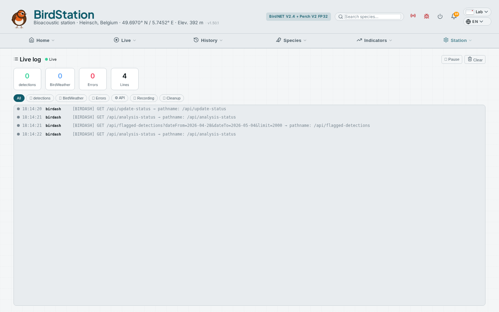
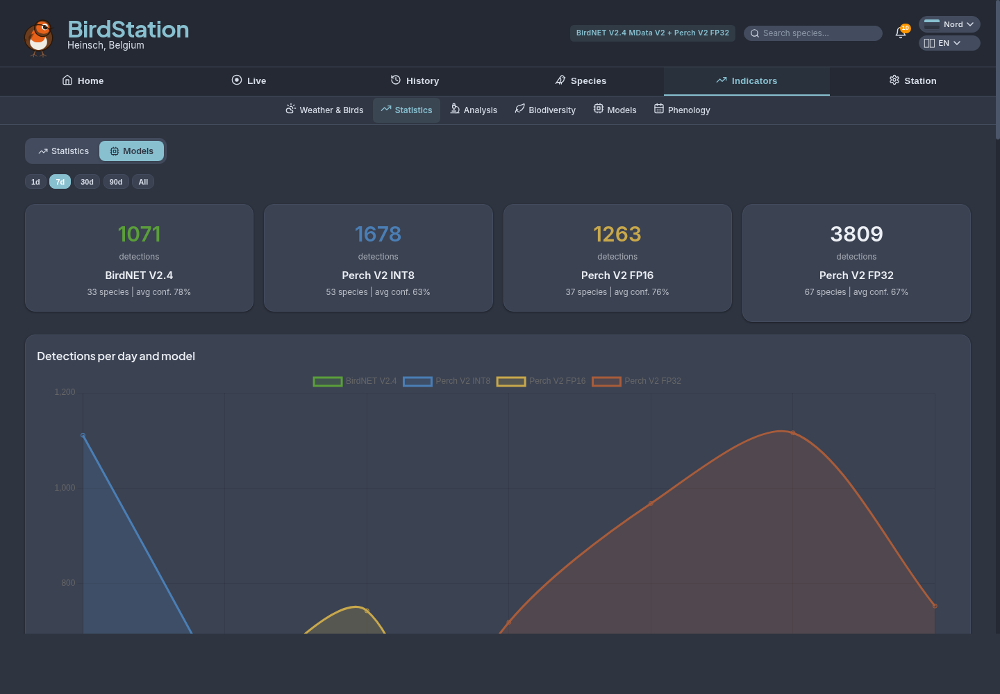

# 🐦 BirdStation

[](LICENSE)
[](https://nodejs.org)
[](https://vuejs.org)
[](CONTRIBUTING.md)

Modern bird detection dashboard and engine for Raspberry Pi 5. Standalone dual-model architecture with BirdNET V2.4 + Perch V2. Community network with live station map. Customizable station name and branding.

> [Francais](README.fr.md) | [Nederlands](README.nl.md) | [Deutsch](README.de.md) | [Contributing](CONTRIBUTING.md)

## Screenshots

<details>
<summary><b>Home</b> — Overview · Today</summary>

<p align="center">
  
  
</p>
</details>

<details>
<summary><b>Live</b> — Dashboard · Spectrogram · Log</summary>

<p align="center">
  
  
  
</p>
</details>

<details>
<summary><b>History</b> — Calendar · Timeline · Detections · Review</summary>

<p align="center">
  
  
  
  
</p>
</details>

<details>
<summary><b>Species</b> — Species · Recordings · Rarities · Favorites</summary>

<p align="center">
  
  
  
  
  
</p>
</details>

<details>
<summary><b>Indicators</b> — Weather · Statistics · Models · Analyses · Biodiversity · Phenology</summary>

<p align="center">
  
  
  
  
  
  
</p>
</details>

<details>
<summary><b>Station</b> — System health, settings &amp; terminal</summary>

<p align="center">
  
  
  
  
</p>
<p align="center">
  
  
  
  
</p>
<p align="center">
  
  
  
  
</p>
</details>

## Architecture

> **[Full architecture documentation →](ARCHITECTURE.md)** — deep technical reference covering audio pipeline, database schema, performance, and more.

```
Raspberry Pi 5 + SSD
├── USB Audio Interface
│     ↓
├── BirdEngine (Python)
│   ├── Recording service (arecord → WAV 45s)
│   ├── Audio pipeline: Adaptive Gain → Highpass → Lowpass
│   │   → Noise Profile Subtraction → RMS Normalize
│   ├── BirdNET V2.4    (~1.5s/file, primary)
│   ├── Perch V2         (~0.7s/file on Pi 5, secondary)
│   ├── MP3 extraction + spectrograms
│   └── BirdWeather upload
│
├── Birdash (Node.js)
│   ├── Dashboard API (port 7474)
│   ├── Live spectrogram (PCM + MP3 stream)
│   ├── Push notifications via Apprise (100+ services)
│   ├── Detection review + auto-flagging
│   ├── Telemetry (opt-in Supabase)
│   └── In-app bug reporting (GitHub Issues)
│
├── Caddy (reverse proxy :80)
├── ttyd (web terminal)
└── SQLite (1M+ detections)
```

## Features

### Detection Engine (BirdEngine)
-  **Dual-model inference** — BirdNET V2.4 (~1.5s/file) + Perch V2 (~0.7s/file on Pi 5) in parallel. Model variant auto-selected per Pi: FP32 on Pi 5, FP16 on Pi 4, INT8 on Pi 3
-  **Local recording** — any USB audio interface via ALSA with configurable gain
-  **Adaptive noise normalization** — automatic software gain based on ambient noise, with clip guard, activity hold, and observer mode
-  **Audio filters** — configurable highpass + lowpass (bandpass), spectral noise reduction (stationary gating), RMS normalization
-  **BirdWeather** — automatic upload of soundscapes + detections
-  **Smart push notifications** — via Apprise (ntfy, Telegram, Discord, Slack, email, 100+ services) with species photo attached, station name prefix (`[Heinsch] Merle noir`). 5 configurable rules: rare species, first-of-season, new species, first-of-day, favorites
-  **Async post-processing** — MP3 extraction, spectrogram generation, DB sync don't block inference

### Dashboard (18 pages)

**Home**
-  **Overview** (landing page) — 6 KPIs, bird of the day, weather context, hourly activity, "What's New" alerts, latest detections
-  **Today** — species list with audio player, spectrograms, gain/highpass/lowpass filters, new species filter
-  **Species name translation** — bird names displayed in the user's chosen language across all pages

**Live**
-  **Bird Flow** — animated pipeline showing live audio levels (SSE), dual-model inference with per-model species + confidence, detection flow with animated connectors, today's KPIs, key events feed
-  **Live spectrogram** — real-time audio from mic with bird name overlay
-  **Live log** — real-time streaming dashboard (SSE) with color-coded categories, KPIs, pause/resume
-  **Live Board** — full-screen kiosk display for a dedicated screen: large species photo, KPIs, today's species list, weather, auto-refresh 30s, discreet back button

**History**
-  **Calendar** — monthly grid with per-day species count, detection count and activity heatmap. Click any day to open the detail view
-  **Timeline** — full-page interactive timeline with drag-to-zoom, unified bird density slider (0-100%), SVG sunrise/sunset/moon icons, type filter badges with blink highlight, confidence-mapped vertical layout
-  **Detections** — full filterable table with favorites, new species filter, per-detection delete, CSV/eBird export
-  **Review** — auto-flagged detections with spectro modal, bulk confirm/reject/delete with preview, purge rejected

**Species**
-  Species cards with photos (iNaturalist + Wikipedia), IUCN status, favorites (SQLite-backed), personal notes (per-species and per-detection), phenology calendar (12-month dot map), year-over-year monthly comparison, chart PNG export, Web Share API
-  **Favorites** — dedicated page with KPIs, search, sort; heart toggle on all species lists
-  Rare species tracking
-  **Recordings** — unified audio library with two tabs: "Library" (all recordings, sortable/filterable) and "Best" (top recordings grouped by species)

**Indicators**
-  **Weather** — dedicated page with correlation analysis (Pearson r), tomorrow's forecast, species by weather conditions
-  **Statistics** — rankings, records, distributions, annual evolution; integrated **Models** tab for dual-model comparison (daily chart, exclusive species, overlap analysis)
-  Advanced analyses (polar charts, heatmaps, time series, narrative)
-  Biodiversity — Shannon index, adaptive richness chart, taxonomy heatmap
-  **Phenology calendar** — observed annual cycle per species (presence/abundance/hourly modes), inferred phases (active period, peak abundance, dawn chorus, migrant detection), 53-week ribbon visualization, species suggestions on empty state

**Navigation**
- 6 intent-based sections: Home, Live, History, Species, Indicators, Station
- Mobile bottom nav (4 quick links + hamburger drawer with all 18 pages)
- Global species+date search, notification bell, review badge counter
- Keyboard shortcuts on 5 pages, swipe gestures on species photos
- Skeleton loading states for data-heavy pages
- Cross-navigation between settings and system pages

### Detection Review
-  **Auto-flagging** — nocturnal birds by day, out-of-season migrants, low confidence isolates, non-European species
-  **Bulk actions** — confirm/reject/delete by rule, per-selection, or purge all rejected
-  Full spectrogram modal with gain/highpass/lowpass filters and loop selection for manual verification
-  **Permanent deletion** — preview modal listing what will be deleted (DB + audio files), with result report

### Audio Configuration
-  Auto-detection of USB audio devices with one-click selection
-  **Adaptive gain** — noise floor estimation, clip guard, activity hold, observer/apply modes
-  **Bandpass + denoise** — highpass (50-300 Hz), lowpass (4-15 kHz), spectral gating (noisereduce), all toggleable per profile
-  **Ambient noise profile** — record 5s of background noise (highway, HVAC), used for targeted spectral subtraction via noisereduce `y_noise` — more effective than auto-denoise for constant noise sources
-  **Filter preview** — before/after spectrograms from live mic to visualize the effect of each filter including the noise profile
-  **Audio pipeline** — Mic → Adaptive Gain → Highpass → Lowpass → Noise Profile (or auto denoise) → RMS Normalize → BirdNET + Perch — visual pipeline diagram in Settings
-  6 environment profiles (garden, forest, roadside, urban, night, test)
-  Inter-channel calibration wizard for dual EM272 microphones
-  Real-time VU meters via SSE

### Community Network
-  **BirdStation Network** — opt-in community of stations sharing daily detection summaries via Supabase
-  **[Live station map](https://ernens.github.io/birdash-network/)** — all registered stations on an interactive dark-themed map
-  **In-app bug reporting** — submit issues directly to GitHub from the dashboard header, with optional log attachment (last hour of service logs included in the issue)

### Settings & System
-  Full settings UI — models (one-click BirdNET download with license acceptance), analysis parameters, notifications, audio, backup
-  **Interactive GPS map** — Leaflet/OpenStreetMap widget in station settings with click-to-set, drag marker, and geolocation button
-  System health — CPU, RAM, disk, temperature, services
-  **Web terminal** — full bash in browser, supports Claude Code
-  **Backup** — NFS/SMB/SFTP/S3/GDrive/WebDAV with scheduling
-  **11 themes** — 7 dark (Forest, Night, Ocean, Dusk, Solar Dark, Nord, High Contrast AAA), 3 light (Paper, Sepia, Solar Light), plus an **Auto** mode that follows the OS `prefers-color-scheme`. Mini page previews in the picker, smooth cross-fade between themes, fully token-driven (design system documented in [`docs/THEMES.md`](docs/THEMES.md))
-  **Photo management** — ban/replace photos, set preferred photo per species
-  **Customizable branding** — configurable station name and header brand via settings
-  4 UI languages (FR/EN/NL/DE) + 36 languages for species names

## Optimized Perch V2 Models

We publish **3 optimized Perch V2 TFLite models** for edge deployment, converted from the official Google SavedModel:

**[ernensbjorn/perch-v2-int8-tflite](https://huggingface.co/ernensbjorn/perch-v2-int8-tflite)** on HuggingFace

| Model | Size | Latency (Pi 5) | Top-1 | Top-5 | Best for |
|-------|------|---------------|-------|-------|----------|
| `perch_v2_original.tflite` | 409 MB | 435 ms | baseline | baseline | **Pi 5** (default) |
| `perch_v2_fp16.tflite` | 205 MB | 384 ms | 100% | 99% | **Pi 4** (default) |
| `perch_v2_dynint8.tflite` | 105 MB | 299 ms | 93% | 90% | **Pi 3** (default) |

Benchmarked on Raspberry Pi 5 (8 GB, Cortex-A76 @ 2.4 GHz), 20 real bird recordings from 20 species, 5 runs each, 4 threads. The installer auto-selects the optimal variant for your Pi model.

## Hardware

| Component | Recommended |
|-----------|-------------|
| SBC | Raspberry Pi 5 (8GB) recommended — also works on Pi 4 (4GB+) and Pi 3 (1GB, INT8 models only) |
| Storage | NVMe SSD (500GB+) |
| Audio | Any USB audio interface (e.g., RODE AI-Micro, Focusrite Scarlett, Behringer UMC, UGreen 30724) + microphone |
| Network | Ethernet or WiFi |

## Prerequisites

- Raspberry Pi 3/4/5 with Raspberry Pi OS 64-bit (Bookworm/Trixie) — Pi 5 recommended for dual-model
- Internet connection (for initial setup and model download)
- USB audio interface + microphone(s)
  - Lavalier (clip-on) microphones with **TRRS** plug need a **TRRS→TRS adapter** for standard USB sound cards
  - The installer auto-configures ALSA with a software gain boost for low-sensitivity USB mics

All other dependencies are installed automatically by the installer.

## Installation

### One-line install (recommended)

```bash
curl -sSL https://raw.githubusercontent.com/ernens/birdash/main/bootstrap.sh | bash
```

That's it. The bootstrap installs git if needed, clones the repo into `~/birdash`, runs `install.sh` non-interactively, downloads the BirdNET V2.4 model, enables dual-model detection (BirdNET + Perch), and starts all services. When it finishes, open the dashboard URL printed at the end and tweak GPS/audio from **Settings**.

BirdNET V2.4 is under **CC-BY-NC-SA 4.0** (non-commercial use — see the [BirdNET-Analyzer repo](https://github.com/kahst/BirdNET-Analyzer)). To skip the BirdNET download and use Perch-only:

```bash
curl -sSL https://raw.githubusercontent.com/ernens/birdash/main/bootstrap.sh | BIRDASH_SKIP_BIRDNET=1 bash
```

### Manual install

```bash
# 1. Clone and install
cd ~
git clone https://github.com/ernens/birdash.git
cd birdash
chmod +x install.sh
./install.sh                # interactive
# or: ./install.sh --yes    # non-interactive

# 2. Start all services
sudo systemctl enable --now birdengine-recording birdengine birdash caddy ttyd

# 3. Open the dashboard and configure
#    → Settings → Station: set GPS coordinates via interactive map
#    → Settings → Detection: download BirdNET V2.4 (one-click)
#    → Settings → Audio: select your USB audio device
```

The installer handles everything: system packages, Caddy, ttyd, databases, Perch V2 models (auto-downloaded from HuggingFace, variant adapted to your Pi model), services, and cron jobs. BirdNET V2.4 is installed via the dashboard (CC-NC-SA license acceptance required).

Your dashboard will be available at `http://yourpi.local/birds/`


## Updating

### In-app update (recommended)

When a new version is available, a red banner appears at the top of every page with the version number (e.g. `v1.5.30 → v1.5.48`). Click **View** to see categorized release notes, then:

- **Install now** — applies the update, restarts services, shows progress
- **Later (24h)** — snoozes the banner for 24 hours
- **Skip these updates** — hides until a newer version is published

The update runs `scripts/update.sh` which handles `git pull`, migrations, `npm install` if needed, and selective service restarts. Your data and configuration are preserved.

### Remote update via SSH

```bash
ssh user@yourpi.local 'bash ~/birdash/scripts/update.sh'
```

### Fan-out to multiple stations

```bash
for h in mickey donald papier; do
  ssh "$h.local" 'bash ~/birdash/scripts/update.sh'
done
```

### How it works

- `/api/update-status` compares `git rev-parse HEAD` against `git ls-remote origin main` (1-minute cache)
- Version number is auto-computed from `git describe` (e.g. `v1.5.0` tag + 48 commits = `v1.5.48`)
- Snooze state stored server-side in `config/update-state.json` (persistent across browsers)
- Migrations in `scripts/migrations/` run automatically after each pull (idempotent)
- `BIRDASH_SKIP_BIRDNET=1` skips BirdNET download during install if desired

## What the Installer Does

| Step | Action |
|------|--------|
| 1 | System packages (Node.js, Python, ffmpeg, alsa, sqlite3, Caddy, ttyd) |
| 2 | Node.js dependencies |
| 3 | Python venv + ML dependencies (ai-edge-litert, numpy, soundfile, resampy, scipy, noisereduce) |
| 4 | Directory structure (audio, models, BirdSongs) |
| 5 | Database bootstrap (birds.db + birdash.db with full schema) |
| 6 | GeoIP auto-detection (latitude, longitude, language from [ipapi.co](https://ipapi.co)) |
| 7 | Configuration files (birdnet.conf with Pi-aware defaults, engine config, ALSA dsnoop for shared mic access) |
| 8 | Model download — Perch V2 from HuggingFace (auto: FP32 on Pi 5, FP16 on Pi 4, INT8 on Pi 3) |
| 9 | Systemd services with `KillMode=process` (engine, recording, dashboard, terminal) |
| 10 | Caddy reverse proxy |
| 11 | BirdNET V2.4 download via birdnetlib (CC-BY-NC-SA 4.0) + l18n species labels (38 languages) |
| 12 | Enable dual-model (BirdNET primary + Perch secondary), start all services |

> **Note:** BirdNET V2.4 download can be skipped with `BIRDASH_SKIP_BIRDNET=1` and installed later from the dashboard: **Settings → Detection → Download BirdNET V2.4**.

## Tests

```bash
# Node.js backend tests (160 tests including cross-page coherence)
npm test

# Python engine tests (13 tests)
cd engine && ../engine/venv/bin/python -m unittest test_engine -v
```

## Project Structure

```
birdash/
├── server/
│   ├── server.js                  # HTTP server, middleware, route delegations (271 lines)
│   ├── lib/
│   │   ├── alerts.js              # System alert monitoring (temp, disk, RAM)
│   │   ├── alert-i18n.js          # Alert message translations (4 langs)
│   │   ├── config.js              # BirdNET config, settings validators, exec helper
│   │   ├── db.js                  # Database bootstrap, tables, taxonomy
│   │   ├── notification-watcher.js # Push notifications (polls DB, sends via Apprise)
│   │   ├── telemetry.js           # Community telemetry (Supabase)
│   │   └── whats-new-worker.js    # Worker thread for heavy computation
│   └── routes/
│       ├── audio.js               # Audio devices, adaptive gain, streaming
│       ├── backup.js              # Backup config, scheduling, export
│       ├── data.js                # Favorites, notes, photo-pref, query
│       ├── detections.js          # Detections, validations, flagging
│       ├── external.js            # BirdWeather, eBird, weather APIs
│       ├── photos.js              # Photo resolution/caching, species names
│       ├── settings.js            # Settings, apprise, alerts, logs SSE
│       ├── system.js              # Services, health, hardware, models
│       ├── bug-report.js           # In-app bug reporting (GitHub Issues)
│       ├── telemetry.js            # Opt-in telemetry (Supabase)
│       ├── timeline.js            # Timeline with SunCalc astronomy
│       └── whats-new.js           # Daily overview cards
├── public/                        # Static frontend (Vue 3 (vendored))
│   ├── index.html                 # Redirect to overview.html
│   ├── overview.html               # Landing page — KPIs, bird of the day, weather
│   ├── dashboard.html              # Bird Flow — live pipeline visualization
│   ├── today.html                 # Today's detections with audio filters
│   ├── calendar.html              # Monthly calendar grid with activity heatmap
│   ├── timeline.html              # Full-page timeline with drag-to-zoom
│   ├── detections.html            # Filterable detection table
│   ├── review.html                # Detection review + bulk actions
│   ├── species.html               # Species cards + favorites + notes
│   ├── gallery.html               # Redirect → recordings.html
│   ├── favorites.html             # Favorites with stats + management
│   ├── weather.html               # Weather/activity correlation
│   ├── stats.html                 # Statistics + integrated Models tab
│   ├── analyses.html              # Per-species deep analysis
│   ├── biodiversity.html          # Shannon index, adaptive richness chart
│   ├── phenology.html             # Observed phenology calendar (per species)
│   ├── spectrogram.html           # Live spectrogram + clip playback
│   ├── settings.html              # Full settings (9 tabs)
│   ├── system.html                # System health + terminal
│   ├── liveboard.html              # Live Board — kiosk display mode
│   ├── log.html                   # Live log dashboard (SSE)
│   ├── recordings.html            # Audio library with photos
│   ├── rarities.html              # Rare species tracker
│   ├── recent.html                # Redirect to calendar.html
│   ├── models.html                # Redirect to stats.html?tab=models
│   ├── js/
│   │   ├── bird-config.js         # Navigation, API config
│   │   ├── bird-queries.js        # Shared SQL query library (38 queries)
│   │   ├── bird-icons.js          # Lucide icon set (98 SVG icons)
│   │   ├── bird-shared.js         # Utilities, DSP, favorites, notes API
│   │   ├── bird-vue-core.js       # Vue composables, i18n (4 langs), shell
│   │   ├── bird-spectro-modal.js # SpectroModal component (extracted)
│   │   ├── bird-timeline.js       # Timeline rendering (sky, stars, markers)
│   │   ├── vue.global.prod.min.js # Vue 3 (vendored)
│   │   ├── chart.umd.min.js      # Chart.js (vendored)
│   │   └── echarts.min.js        # ECharts (vendored)
│   ├── i18n/                      # Translation files (fr/en/de/nl.json)
│   ├── css/                       # Styles + 11 themes (see docs/THEMES.md)
│   ├── settings/                  # Lazy-loaded settings tab fragments
│   └── sw.js                      # Service Worker (offline cache)
├── engine/                        # BirdEngine (Python detection engine)
│   ├── engine.py                  # Dual-model inference (~1100 lines)
│   ├── config.toml                # Engine configuration
│   ├── record.sh                  # Audio capture (arecord)
│   ├── purge_audio.sh             # Disk space management
│   ├── convert_from_saved_model.py # Perch V2 optimization script
│   ├── birdengine.service         # systemd: detection engine
│   ├── birdengine-recording.service # systemd: audio capture
│   ├── ttyd.service               # systemd: web terminal
│   └── models/                    # TFLite models (not in git)
├── config/
│   ├── birdash.service            # systemd: dashboard
│   ├── audio_config.json          # Audio device config
│   ├── audio_profiles.json        # 6 environment profiles
│   ├── detection_rules.json       # Auto-flagging rules
│   └── birdash-local.example.js   # Local config template
├── scripts/
│   └── backup.sh                  # Incremental backup (rsync)
├── tests/
│   └── server.test.js             # Backend tests
├── README.md                      # English
├── README.fr.md                   # Francais
├── README.nl.md                   # Nederlands
└── README.de.md                   # Deutsch
```

## Environment Variables

| Variable | Default | Description |
|----------|---------|-------------|
| `BIRDASH_PORT` | `7474` | API server port |
| `BIRDASH_DB` | `~/birdash/data/birds.db` | SQLite database path |
| `EBIRD_API_KEY` | — | eBird API key (optional) |
| `BW_STATION_ID` | — | BirdWeather station ID (optional) |

## Security

- Rate limiting: 300 req/min per IP
- Strict SQL validation (read-only, parameterized)
- Centralized SQL query library (`bird-queries.js`) — 38 parameterized queries with automatic confidence filtering
- Lucide icon system (`bird-icons.js` + `<bird-icon>` component) — 100+ modern SVG icons, theme-aware form controls (`accent-color`)
- Security headers (CSP, X-Frame-Options, Referrer-Policy)
- CORS restricted to localhost
- Worker threads for heavy computation (event-loop non-blocking)
- Auto-download of species translation labels when missing (BirdNET GitHub fallback)

## Community

- **[Live Station Map](https://ernens.github.io/birdash-network/)** — see all registered BirdStation installations worldwide
- **[Report a bug](https://github.com/ernens/birdash/issues)** — or use the in-app bug report button (red bug icon in header)
- **[Discussions](https://github.com/ernens/birdash/discussions)** — questions, ideas, show your setup

## License

[MIT](LICENSE)
