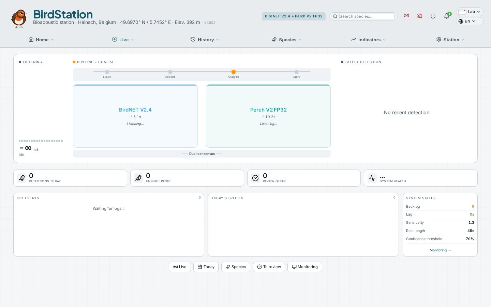
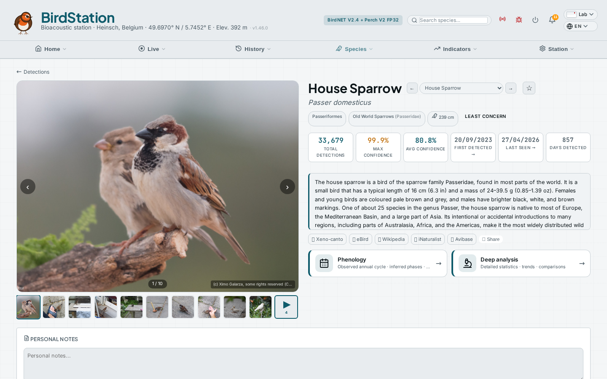
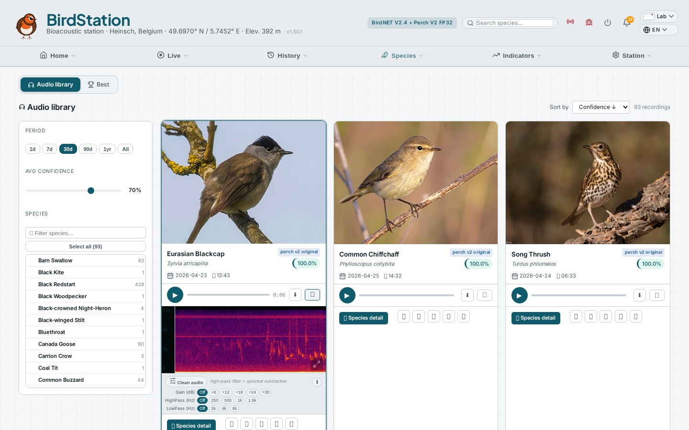
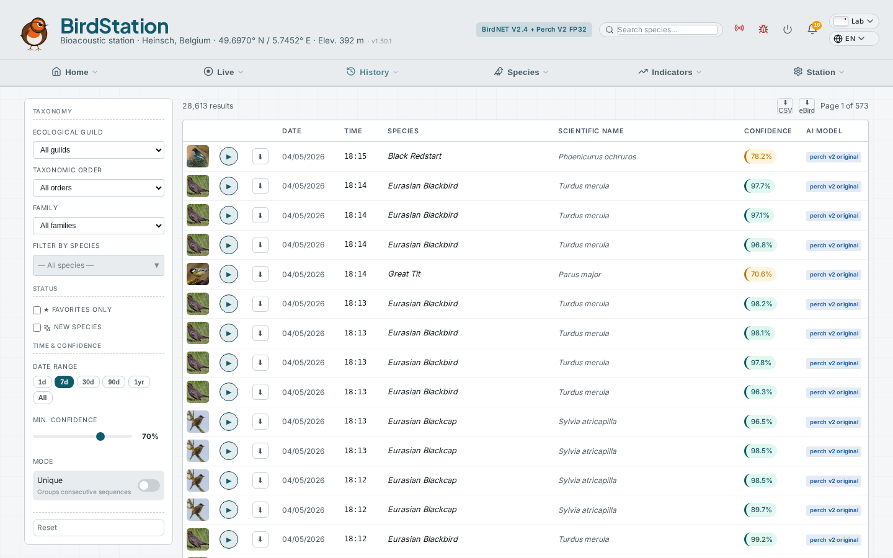
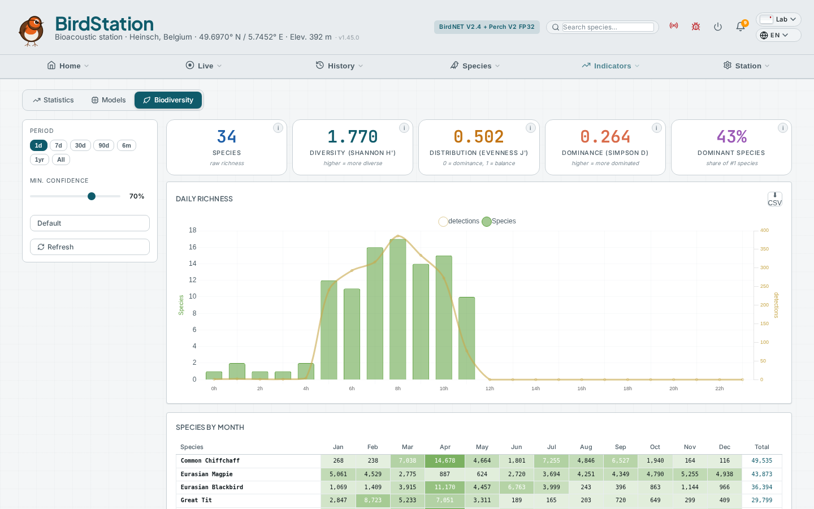
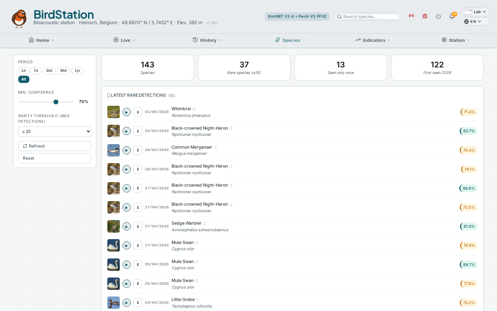
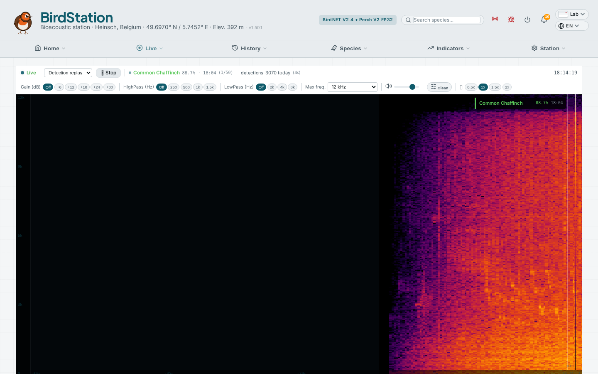
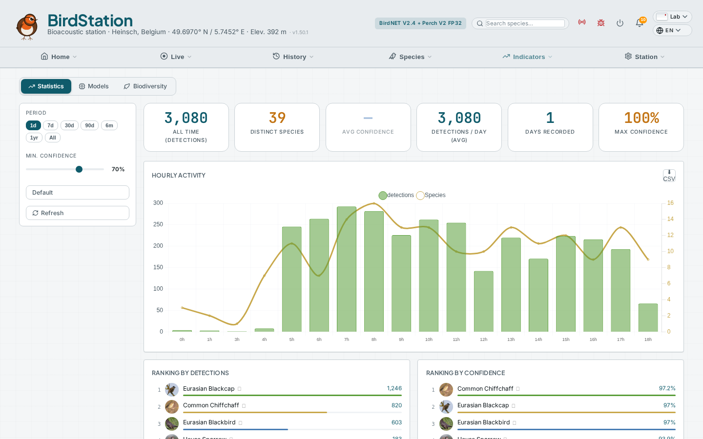

# 🐦 Birdash

[](LICENSE)
[](https://nodejs.org)
[](https://vuejs.org)
[](CONTRIBUTING.md)

Modern ornithological dashboard for [Nachtzuster/BirdNET-Pi](https://github.com/Nachtzuster/BirdNET-Pi).
Vue 3 (CDN) frontend with Node.js backend, multilingual (FR/EN/NL/DE + 36 languages for species names).

> **Birdash is not a fork** — it's a standalone replacement dashboard for BirdNET-Pi's native web interface.

> [Français](README.fr.md) · [Nederlands](README.nl.md) · [Deutsch](README.de.md) · [Contributing](CONTRIBUTING.md)

## Screenshots

| Dashboard | Species Detail |
|:-:|:-:|
|  |  |

| Recordings | Detections |
|:-:|:-:|
|  |  |

| Biodiversity | Rarities |
|:-:|:-:|
|  |  |

| Spectrogram | Statistics |
|:-:|:-:|
|  |  |

## Features

- 📊 Real-time overview with 6 KPIs and charts (today's activity + 7-day trend with trendline)
- 🎙️ Detection feed with integrated audio playback
- 🦜 Detailed species cards with photo carousel (iNaturalist + Wikipedia)
- 🧬 Taxonomy info, IUCN conservation status, wingspan
- 🗓️ Biodiversity matrix (hours x species)
- 💎 Rare species and alerts
- 📈 Statistics and rankings
- 🎵 Audio spectrogram with DSP noise reduction
- 🏆 Best recordings with uniform photos and player
- 🖥️ System status (CPU, RAM, disk, temperature)
- 🔬 Advanced analyses
- 🔧 **Settings page** — model selector, analysis parameters, services management, ⓘ help tooltips on every parameter
- 🤖 **Perch v2 support** — Google Research model (10,340 bird species) with temperature-scaled softmax, bird-only filter, and MData geographic filter
- 🔄 **Model comparison** — side-by-side period comparison with species gained/lost, per-species table, nocturnal detection monitoring
- 🏷️ **Model tracking** — each detection records which AI model identified it (displayed across all pages)
- 🗑️ **Detection management** — delete individual detections or bulk-delete an entire species (with typed-name confirmation safety)
- 💾 **Backup management** — multi-destination backup (USB/Local, SMB/CIFS, NFS, SFTP, Amazon S3, Google Drive, WebDAV) with content selection (DB, audio, config), scheduling (manual/daily/weekly), live progress bar, pause/resume/stop controls, disk space monitoring, and automatic legacy script detection
- ⚡ Service Worker for offline caching
- ♿ Accessibility (WCAG AA, keyboard navigation, skip-link)
- 🎨 5 modern themes (Forest, Night, Paper, Ocean, Dusk)
- 🌍 4 UI languages (FR / EN / NL / DE) + species names auto-translated in 36 languages via BirdNET labels

## Tested with

| BirdNET-Pi | Hardware | Status |
|------------|----------|--------|
| [Nachtzuster/BirdNET-Pi](https://github.com/Nachtzuster/BirdNET-Pi) | Raspberry Pi 4/5 | ✅ Tested |

## Prerequisites

- [Nachtzuster/BirdNET-Pi](https://github.com/Nachtzuster/BirdNET-Pi) running (`~/BirdNET-Pi/scripts/birds.db` present)
- Node.js >= 18 (`node --version`)
- Caddy (see Caddy Configuration section below)

## Installation

```bash
# 1. Clone the repository
cd ~
git clone https://github.com/ernens/birdash.git
cd birdash

# 2. Install dependencies
npm install

# 3. Local configuration
cp config/birdash-local.example.js public/js/birdash-local.js
nano public/js/birdash-local.js

# 4. Test the server
node server/server.js
# -> [BIRDASH] API started on http://127.0.0.1:7474
# Test: curl http://127.0.0.1:7474/api/health

# 5. Run tests
npm test

# 6. Install systemd service
sudo cp config/birdash.service /etc/systemd/system/
sudo systemctl edit birdash
#    [Service]
#    Environment=EBIRD_API_KEY=your_key
#    Environment=BW_STATION_ID=your_station
sudo systemctl daemon-reload
sudo systemctl enable birdash
sudo systemctl start birdash
```

## Caddy Configuration

Birdash uses Caddy as a reverse proxy to serve the API, audio files,
and static pages under a single `/birds/` path.

### 1. Install Caddy (if not already installed)

```bash
sudo apt install -y debian-keyring debian-archive-keyring apt-transport-https
curl -1sLf 'https://dl.cloudsmith.io/public/caddy/stable/gpg.key' | sudo gpg --dearmor -o /usr/share/keyrings/caddy-stable-archive-keyring.gpg
curl -1sLf 'https://dl.cloudsmith.io/public/caddy/stable/debian.deb.txt' | sudo tee /etc/apt/sources.list.d/caddy-stable.list
sudo apt update
sudo apt install caddy
```

### 2. Configure the Caddyfile

Edit `/etc/caddy/Caddyfile` and add the Birdash block:

```
YOUR_HOSTNAME {
    encode zstd gzip

    # API: proxy to Node.js backend
    handle /birds/api/* {
        uri strip_prefix /birds
        reverse_proxy 127.0.0.1:7474
    }

    # Audio: extracted audio files from BirdNET-Pi
    handle /birds/audio/* {
        uri strip_prefix /birds/audio
        root * /home/{USER}/BirdSongs/Extracted
        file_server
    }

    # Static dashboard pages
    handle /birds* {
        uri strip_prefix /birds
        root * /home/{USER}/birdash/public
        file_server
    }
}
```

Replace `{USER}` with your system username.

### 3. Apply

```bash
caddy validate --config /etc/caddy/Caddyfile
sudo systemctl reload caddy
```

## Verification

```bash
# Test the API
curl http://127.0.0.1:7474/api/health

# Run backend tests
npm test

# Open the dashboard
# http://YOUR_HOSTNAME/birds/
```

## Project Structure

```
birdash/
├── server/
│   └── server.js              # Node.js HTTP backend (API + SQLite)
├── tests/
│   └── server.test.js         # Backend tests
├── public/                    # Static files served by Caddy
│   ├── *.html                 # 13 pages (dashboard, species, settings...)
│   ├── js/                    # Client-side JavaScript
│   │   ├── bird-config.js     # Central configuration
│   │   ├── bird-core.js       # Shared utilities
│   │   ├── bird-vue-core.js   # Vue 3 composables (shell, themes)
│   │   └── bird-i18n.js       # i18n engine
│   ├── css/                   # Stylesheets + 5 themes
│   ├── i18n/                  # Translation files (fr/en/nl/de)
│   ├── img/                   # SVG assets
│   └── sw.js                  # Service Worker (offline cache)
├── scripts/
│   └── backup.sh              # Backup script (rsync incremental)
├── config/
│   ├── birdash.service        # systemd service
│   ├── birdash-local.example.js  # Local config template
│   └── backup.json            # Backup configuration
├── screenshots/
├── CONTRIBUTING.md
├── LICENSE
├── package.json
├── README.md                  # English (default)
├── README.fr.md               # Français
├── README.nl.md               # Nederlands
└── README.de.md               # Deutsch
```

## Environment Variables

| Variable | Default | Description |
|----------|---------|-------------|
| `BIRDASH_PORT` | `7474` | API server port |
| `BIRDASH_DB` | `~/BirdNET-Pi/scripts/birds.db` | SQLite database path |
| `EBIRD_API_KEY` | — | eBird API key (optional) |
| `BW_STATION_ID` | — | BirdWeather station ID (optional) |

## Security

- 🛡️ Rate limiting: 120 requests/min per IP
- 🔒 Strict SQL validation (read-only queries, dedicated write connection for deletions only)
- 🔐 Security headers (X-Content-Type-Options, X-Frame-Options, Referrer-Policy)
- 🌐 CORS restricted to configured origins
- ✅ SRI (Subresource Integrity) on CDN scripts
- 🧹 XSS protection (HTML escaping)
- 🙈 SQL error details masked in API responses

## Contributing

Contributions are welcome! See the [contribution guide](CONTRIBUTING.md).

## Updating

```bash
cd ~/birdash
git pull
npm install
sudo systemctl restart birdash
```

## License

[MIT](LICENSE) © ernens
